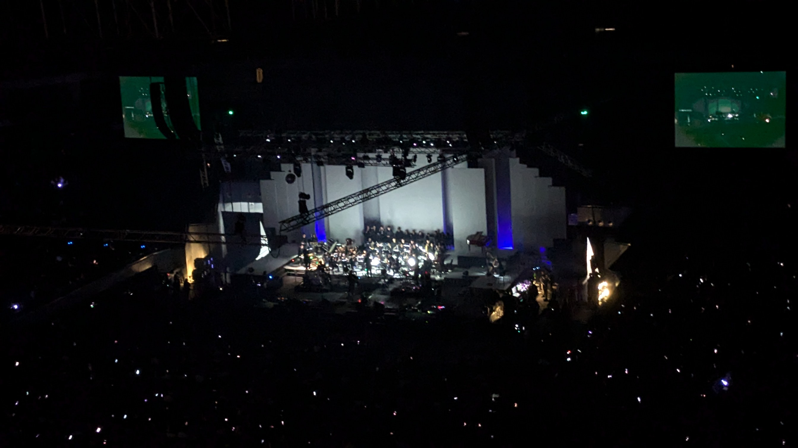
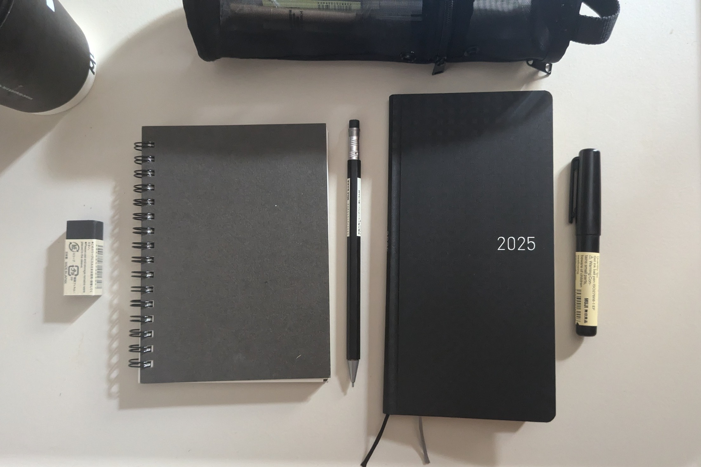

<small style="display: block; text-align: center; margin-top: -1rem;">
December Avenue concert at MOA Arena
</small>

Too late for me to say but merry christmas and happy holidays! i was gonna let this month off the hook but somehow I convinced my bum ass to write this. If you're wondering why I'm only publishing this now let's just say I had the crashout of the century.

December huh. Indeed, a lot has happened. I worked myself to my limit. To the point I was drained and emptied. Even eating and sleeping I forgot how to do it. But greater lessons have been learned and I'm a big girl now.

I don't got much time to format this i hope you enjoy this plaintext soupy mess.

### idea list 

Keeping an ever-growing pile of unfinished projects is a disease. A disease I have. So here is a list of what I'm thinking about building in the next few months, which might or might not see the light.

1. A navigable css design system inspired from physical wayfinding signages as seen from your common public transit systems like subways and airlines.
2. A digital index card themed note taking system inspired by the analog zettelkasten method.
3. Some sort of Life by weeks with a twist, inspired from 'Buster's Notes' [Life in Weeks](https://busterbenson.com/life-in-weeks)
4. a web page as a huge content wall which will carry every book, movie, and song I like. Basically, a public display of my media overconsumption.
5. A weekly digest of some sort with rss support (very important!)

### japanese stationery haul

<small style="display: block; text-align: center; margin-top: -1rem;">
From left to right: Muji black eraser, Muji Plain Craft Ring Notebook in size A6, Hobonichi Weeks in gingham black, Muji Compact Gel Ink Ballpoint.
</small>

I am not the journalling type. Journalling on pen and paper has never worked for me. I have sworn oath that Me and google keep notes would be *forever*, *til death do us part*, until a few days ago as I was casually scrolling through the timeline, this [tweet](https://x.com/mojiminchi_/status/1862657076000170055) revealed itself to me. To think this person has dedicated 3 years in perfecting a system that works for her. Maybe I should give pen and paper another try. Maybe this is the answer.

IT WILL WORK THIS TIME I PROMISE ONCE I GET MY HANDS TO THE PERFECT JOURNAL AND A GEL PEN WHOSE INK DOESN'T BLEED, I WILL BECOME THE MOST PRODUCTIVE PERSON ON EARTH, MY FEATURES WILL BE DELIVERED ON TIME, MY DESIGNS WILL SURPASS GOLDEN STANDARDS, I WILL WRITE EVERY PR PERFECTLY AND MY SENIORS WILL NEVER THINK TWICE TO APPROVE WITH A NOTE "LGTM! :ROCKET EMOJI: ", MAXIMUM EFFICIENCY, I AM LOCKING IN LIKE NO ONE HAS LOCKED IN EVER BEFORE. 

### good finds

some interesting links i found from surfing the web.

1. this reading list someone made on [contemporary criticism](https://z-library.sk/booklist/941545/8120ff/contemporary-criticism.html).
2. I fell into public transit design system psychosis and found this [british rail corporate identity](https:doublearrow.co.uk).
3. An online ebook? a book in the web? I do not know what you call these but I love the concept of a website being a book! [resilientwebdesign.com](resilientwebdesign.com)
4. [The Universal Traveler:](https://archive.org/details/universaltravele00kobe) A Soft-Systems Guide to Creativity, Problem-Solving, and the Process of Reaching Goals 
5. An interview with 'Challengers' director, [Luca Guadagino](https://www.fantasticman.com/articles/luca-guadagnino/) because our current timeline will never meet another director with this kind of *range.*
6. An article in which the [Handmaiden's colorist walks us through before and after scenes were color graded](https://postperspective.com/handmaidens-colorist-walks-us-scenes/).

### song dump

I am putting you all in this gem from the timeline. Very silly cover but very serious song.

<iframe style="border-radius:12px" src="https://open.spotify.com/embed/track/4HnDn4zFT9Iga9XoMCydqb?utm_source=generator" width="100%" height="152" frameBorder="0" allowfullscreen="" allow="autoplay; clipboard-write; encrypted-media; fullscreen; picture-in-picture" loading="lazy"></iframe>

### post notes

can i sign off my emails with

xo,  
juwee
