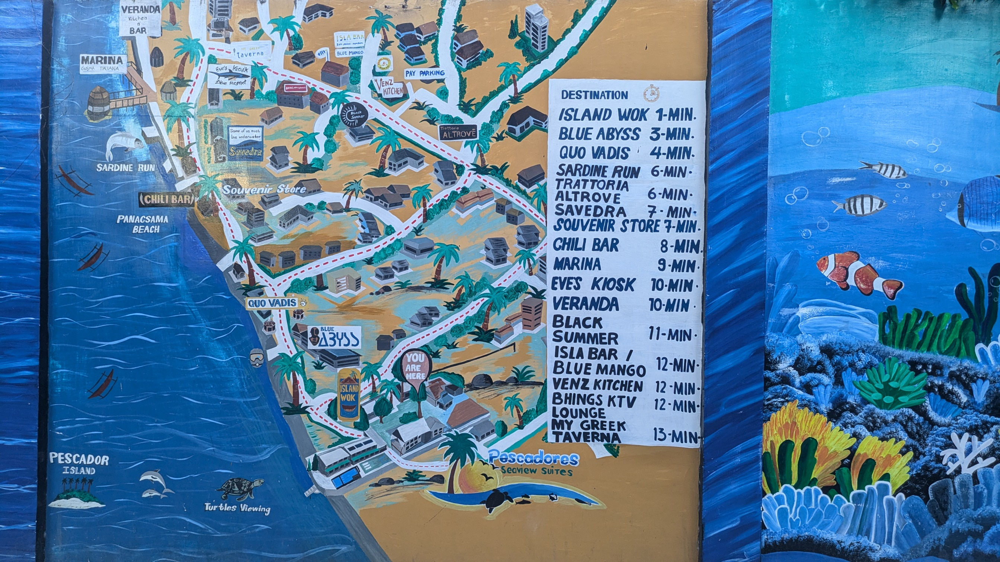

<small>
Trinkets, charms, hand woven coin purse, and a fridge magnet as souvenirs
</small>

Cebu I was in you. For seven days. At the third day, i felt homesickness creeping in. But that doesn't take away from how beautiful you were. A province made up of Cebu Island and 167 smaller islands and islets, powerful concept really.

<small>
White sand beach of Tambuli
</small>

Spend a night at a nature resort located on the eastern coast of Mactan Island. The Olango bird watching sanctuary was a stone throw away which I would've definitely paid a visit if I had known at that time.

### Side trips

Our ride to Southeastern Cebu will take 5 hours and by 2pm we stopped by Paraz Lechon House to eat lunch. The place was an open cafeteria sitting next to hectares of rice fields. The sun was out and it was scorching hot but *Bok bok* the chickens go as they roam around. No expensive menus, just pure authentic home cooked special. It was as if I was eating at someone's Lola's house.

Our second stop, Estino Milk Station. Few people know but when you're on a trip, it's illegal to miss dessert. Never ever skip on sweets. 

<small>
Estino Milk Station
</small>

The place that served the best ice cream in the world was a small shack along the mountains. The secret ingredient is not really a secret. Goat milk. 

The queue wasn't that bad when we arrived. The queue was a small number of people and 15 minutes long. Not bad of a waiting time for the best ice cream in the world.

<small>
A small sign post on a tree by Estino Milk Station
</small>

### Moalboal

<small>
A mural map of Moalboal's town layout and landmarks
</small>

Our end destination is a small town on the southwestern coast of Cebu Island, Moalboal, whose name is likely an onomatopeic derivation "bocalbocal" from the bubbling sound of a spring located within the town.

Moalboal is known for its diving, beaches, and marine life. You could never run out of underwater activities here. One of which was the [Sardine Run](https://philippinetravels.ph/moalboal-sardine-run/), a natural phenominon where millions of Sardines gather to form a "bait ball." The area is a Marine Protected Area which means marine life are safe from being overfished.

I was thrilled to get up close and personal with the fishies but then they told me the sardines leave the shores early and if I want to catch up I'll have to get up before 6am in the morning well I can't swim anyway so who am I kidding? Pass, sadly.

<small>
Quo Vadis Diving Center
</small>

Food was tasty and affordable. We found ourselves at a food court from what felt like an infinite stretch of cafes, bars, and restaurants along the shores. My lungs were strained from the smoke grill but ok if that's what it takes for them to cook our big dinner.

The next morning we had breakfast at an amazing cafe where they served amazing Chicken Butter Waffle which is quite a silly combination if you think about it. Whoever came up with this is a true freak.

Anyway we had two days left and the rest of it I spent in the AirBnB watching anime...

### Lechon eats

<small>
Lechon food court by the sea
</small>

On our way back to the airport and we're having Lechon again for lunch. This is like the third (and the best) place we visit for Lechon. I think I ate enough Lechon for me to go pork-less for a year. I get it. Cebu and Lechon go way way back.

### post notes

I don't know what came to me writing a travel blog seriously? It's a pain to write anything but this is better than just posting on insta. Perhaps my beef with Meta will disappear once they loosen up their API restrictions.

There were silly little moments, places, details that i wished i photographed with my stupid Pixel camera. Like the warning sign at Tambuli Resort about swimming around sharks. 
